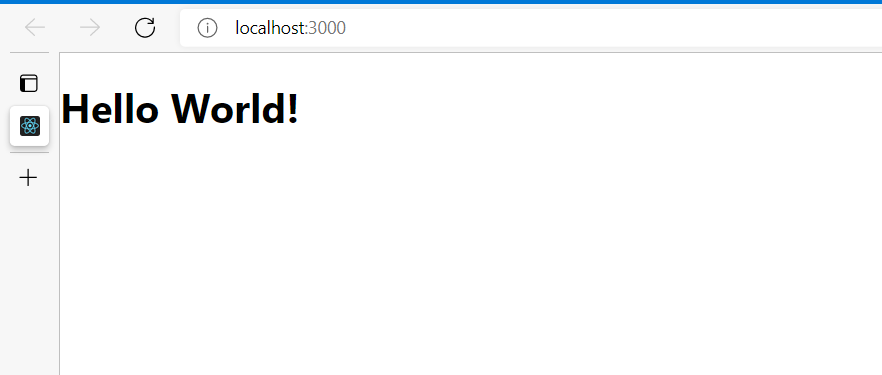
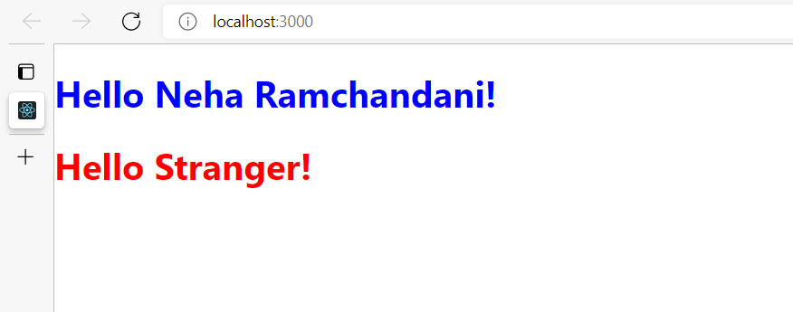

# Initialize React App
Follow up the steps mentioned in [initialization-steps.pdf](https://github.com/nehawork/initialize-react-app/blob/jsx-concept/initialization-steps.pdf) file

## Hello World

## JSX
It is a syntax extension to JavaScript.

Instead of artificially separating technologies by putting markup and logic in separate files, React separates concerns with loosely coupled units called “components” that contain both.

JSX is an Expression Too
After compilation, JSX expressions become regular JavaScript function calls and evaluate to JavaScript objects.
This means that you can use JSX inside of if statements and for loops, assign it to variables, accept it as arguments, and return it from functions

Since JSX is closer to JavaScript than to HTML, React DOM uses camelCase property naming convention instead of HTML attribute names.
For example, class becomes className in JSX.

### Output:
