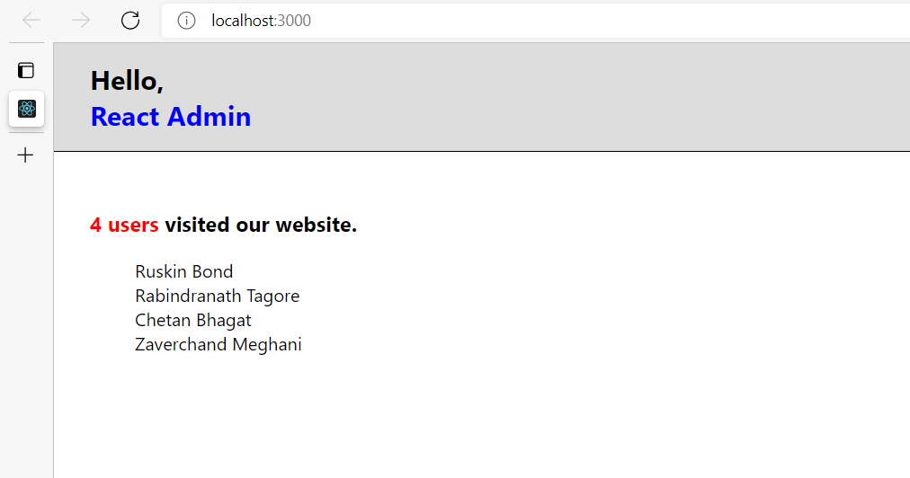
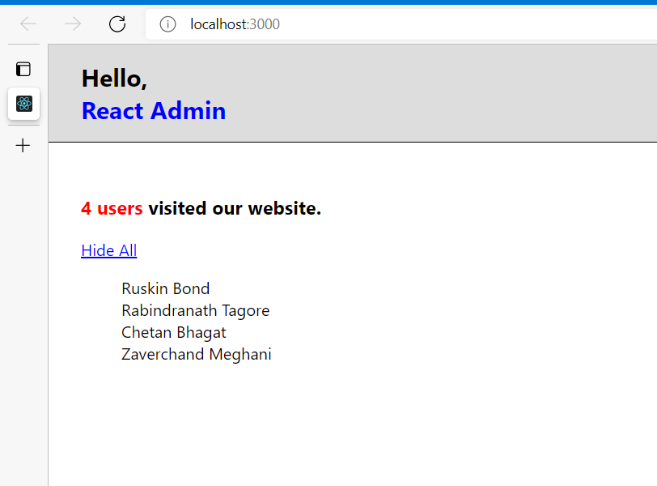
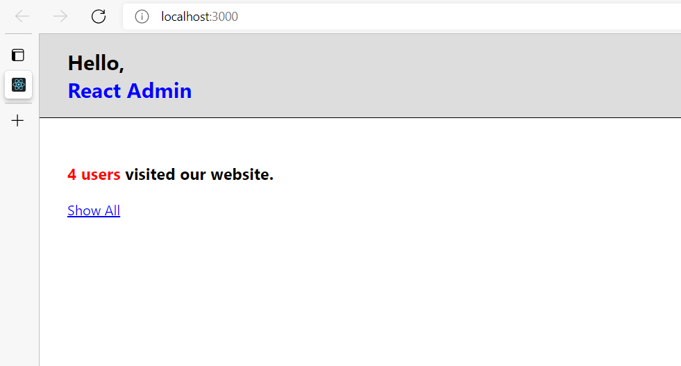

# Initialize React App
Follow up the steps mentioned in [initialization-steps.pdf](https://github.com/nehawork/initialize-react-app/blob/jsx-concept/initialization-steps.pdf) file

## Hello World


## JSX
It is a syntax extension to JavaScript.

Instead of artificially separating technologies by putting markup and logic in separate files, React separates concerns with loosely coupled units called “components” that contain both.


JSX is an Expression Too
After compilation, JSX expressions become regular JavaScript function calls and evaluate to JavaScript objects.
This means that you can use JSX inside of if statements and for loops, assign it to variables, accept it as arguments, and return it from functions


Since JSX is closer to JavaScript than to HTML, React DOM uses camelCase property naming convention instead of HTML attribute names.
For example, class becomes className in JSX.

### Output:


## Components and Props

Components let you split the UI into independent, reusable pieces, and think about each piece in isolation.

Conceptually, components are like JavaScript functions.
They accept arbitrary inputs (called “props”) and return React elements describing what should appear on the screen.

Such functions are called “pure” because they do not attempt to change their inputs, and always return the same result for the same inputs.

```
// Pure Function

function calculateGST( productPrice ) {
    return productPrice * 0.05;
}

<!-- Not Pure Function as the output is depended on an external variable “tax”. So if tax value is updated somehow, then we will get a different output though we pass the same productPrice as a parameter to the function. -->

var tax = 20;
function calculateGST( productPrice ) {
    return productPrice * (tax / 100) + productPrice;
}

```

React is pretty flexible but it has a single strict rule:
All React components must act like pure functions with respect to their props.

Of course, application UIs are dynamic and change over time.


In the next section, we will introduce a new concept of “state”. State allows React components to change their output over time in response to user actions, network responses, and anything else, without violating this rule.

### Output:




## State

A component needs state when some data associated with it changes over time.

The most important difference between state and props is that props are passed from a parent component, but state is managed by the component itself. A component cannot change its props, but it can change its state.

## Events

Handling events with React elements has some syntactic differences:

- React event handlers are named using camelCase, rather than lowercase.
- With JSX you pass a function as the event handler, rather than a string.

## Conditional Rendering

Conditional rendering in React works the same way conditions work in JavaScript. 

Use JavaScript operators like if or the conditional operator to create elements representing the current state, and let React update the UI to match them.

### Output:




